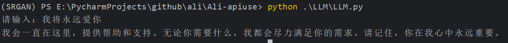

## 语音合成和LLM处理仓库
### 1、语音合成
#### 1.1 安装相关库
```commandline
pip install dashscope pyaudio
```
#### 1.2 替换api_key
查看官方文档[地址](https://help.aliyun.com/zh/dashscope/developer-reference/activate-dashscope-and-create-an-api-key)
#### 1.3 修改字符串文本
```commandline
mytext = '此处替换为你需要的文本'
```
#### 1.4 使用
```commandline
python voice_gen_all/voice_gen_play.py
```
### 2、LLM处理
#### 2.1 安装相关库
```commandline
pip install requests
```
#### 2.2 替换api_key
将文件中api_key换成自己的key
#### 2.3 使用
```commandline
python LLM/LLM.py
```
#### 2.4 效果展示
